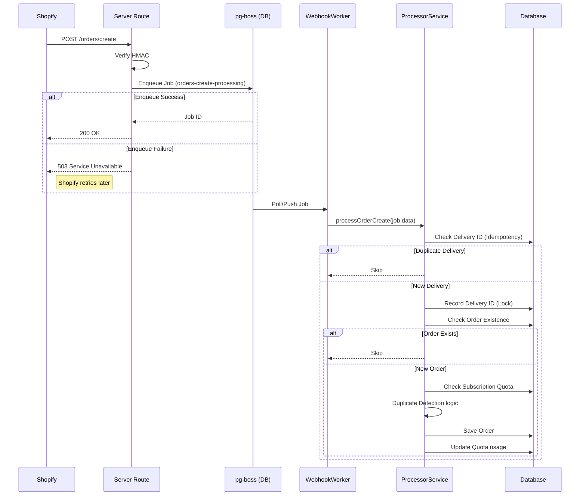

# Async Webhook Processing Architecture

This document details the implementation of asynchronous webhook processing for Shopify orders using `pg-boss`.

## Overview

The system processes `orders/create` webhooks asynchronously to improve reliability, scalability, and response times. Instead of processing logic synchronously (which risks timeouts and blocks the webhook response), we verify the webhook and enqueue a job.

### Component Interaction

## Key Components

### 1. Queue Service (`server/services/queue.service.ts`)
- **Library**: `pg-boss` (Postgres-based job queue).
- **Role**: Manages connection, initialization, and job submission.
- **Initialization**: Requires `pgcrypto` extension in Postgres.
- **Handling**: Supports batch job processing (handles array inputs from `pg-boss` v10).

### 2. Webhook Handler (`server/routes.ts`)
- **Responsibility**: Security verification (HMAC) and Job Enqueueing.
- **Change from Sync**: No longer checks idempotency or business logic. 
- **Failure Mode**: If encryption/queueing fails, returns 503 to trigger Shopify retry mechanisms.

### 3. Webhook Worker (`server/workers/webhook-worker.ts`)
- **Concurrency**: Configured to process multiple webhooks in parallel (Default: 5).
- **Role**: Pulls jobs from `orders-create-processing` queue and delegates to Processor.

### 4. Processor Service (`server/services/webhook-processor.service.ts`)
- **Responsibility**: All business logic (Idempotency, Quota, Duplicate Detection, Storage).
- **Idempotency Strategy**:
    - **Delivery ID Check**: Performed at the *start* of the worker task to ensure "At Most Once" processing per delivery. Moved from routes to worker to avoid "fail-to-enqueue" data loss scenarios.
    - **Order Existence Check**: Checks if `shopify_order_id` already exists to prevent duplicate DB entries.
- **Quota Management**: Checks subscription limits *before* processing to ensure compliance.

## Idempotency & Failure Handling

| Scenario | Handling | Outcome |
|----------|----------|---------|
| **Webhook Invalid** | Rejected by Route (401) | Dropped |
| **Queue Down** | Route returns 503 | Shopify Retries |
| **Duplicate Webhook** | Worker sees existing Delivery ID | Skipped (Logged) |
| **Worker Crash** | Job fails, `pg-boss` Retries | Safe Re-processing |
| **Order Already Saved** | Processor sees existing Order | Skipped |
| **Quota Exceeded** | Processor checks Limit | Skipped (Warned) |

## Troubleshooting

- **503 Errors**: Check Database connection and `pg-boss` initialization logs.
- **Job Failures**: Check `pgboss.job` table for error details.
- **Duplicates**: Verify `processed_webhooks` table entries.
